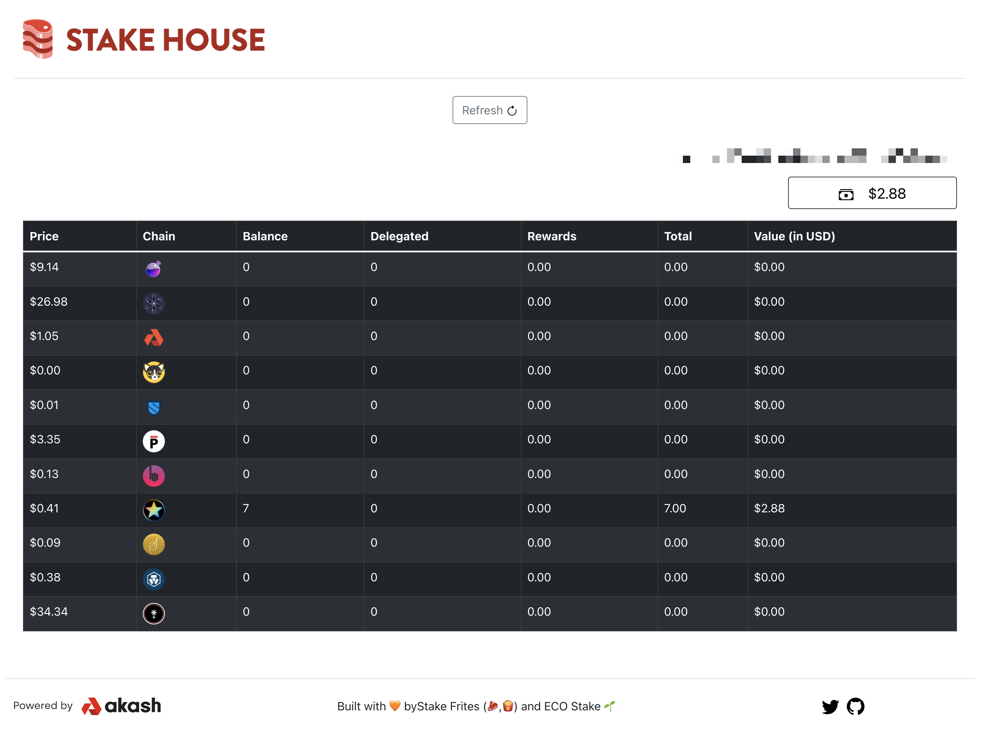

# [Trackmos](https://trackmos.stakefrites.co/)

REStake allows delegators to grant permission for a validator to compound their rewards, and provides a script validators can run to find their granted delegators and send the compounding transactions automatically.

REStake is also a convenient staking tool, allowing you to claim and compound your rewards individually or in bulk. This can save transaction fees and time, and many more features are planned.

Try it out at [trackmos.stakefrites.co](https://trackmos.stakefrites.co/).

## Disclaimer

The initial version of REStake was built quickly to take advantage of the new authz features. I'm personally not a React or Javascript developer, and this project leans extremely heavily on the [CosmJS project](https://github.com/cosmos/cosmjs) and other fantastic codebases like [Keplr Wallet](https://github.com/chainapsis/keplr-wallet) and [Osmosis Zone frontend](https://github.com/osmosis-labs/osmosis-frontend). It functions very well and any attack surface is very limited however. Any contributions, suggestions and ideas from the community are extremely welcome.

## ECO Stake 🌱

ECO Stake is a climate positive validator, but we care about the Cosmos ecosystem too. We built REStake to make it easy for all validators to run an autocompounder with Authz, and it's one of many projects we work on in the ecosystem. [Delegate with us](https://ecostake.com) to support more projects like this.
